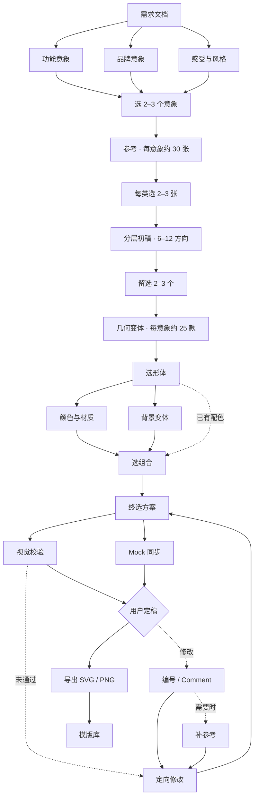

# Logo Atelier 1.0

**Agent 发散，设计师收敛；在 Figma 中把想法变成可拆分、可混搭、可追溯的 Logo。**

面向 Codex 的 Logo / App Icon 设计 Skill。Agent 读取需求、在线找参考、绘制可编辑 SVG，并把分层方案、评论迭代、mock 与导出串成完整工作流。设计师通过编号或 Figma Comment 做选择，保留 human in the loop。

本次更新：**1.0 工作流 · 2026-09-22**。这是流程版本；本地 CLI/插件包有独立版本。Skill 由 Agent 和已连接的 Figma 工具执行，不是独立 Figma 插件或已部署的图执行服务。

[完整流程](skills/logo-atelier/references/workflow-1.0.md) · [开始使用](#开始使用) · [能力边界](#当前能力边界)

## 工作流



通常 **6 个主要设计决策点**，不是固定 11 次提问。需求澄清最多 1–3 轮；终选根据反馈继续。普通偏好暂未回复时，Agent 会在合理等待后说明暂选并推进；最终定稿仍以用户明确选择为准。

| 步骤 | Agent 的产出 | 设计师的选择 |
| --- | --- | --- |
| 01 解析需求 | 从核心功能、名字含义、感受与风格推导可画的意象；可选首字母延展 | 2–3 个核心意象 |
| 02 找 Reference | 每个意象约 30 张参考，独立 Figma Section、来源与编号 | 每类 2–3 张，编号或 Comment |
| 03 分层初稿 | 主体黑白几何、背景、中景；6–12 个方向、2–3 个代表组合 | 保留 2–3 个方向 |
| 04 几何变体 | 按需补形态参考，每个选中意象约 25 个变体 | 选形体、表情与结构 |
| 05 色彩与材质 | 每个选中形体约 25 个色材方案，背景单独对照 | 选组合或跨方案混搭 |
| 06 终选方案1 | 根据评论整合形体、色材与背景 | 选择或 Comment |
| 07 终选方案2 | 继续广泛探索时每个候选约 25 款，局部修改保持局部 | 选择或 Comment |
| 08 终选方案3 | 定向参考、修改、视觉验收、同步设备 mock | 检查真实小尺寸效果 |
| 09 终选方案4+ | 反馈 → 参考 → 修改 → 验证 → mock 的迭代回路 | 明确最终方案 |
| 10 导出 | 确认平台及打包位置，按平台规范交付 SVG / PNG 等 | 确认未明确的交付项 |
| 11 模版库 | 归档 final 的分层资产、预览、色材与来源版本 | 复用到后续项目 |

任何终选轮已满意都可以直接定稿，不必强制做满四轮。局部请求直接进入对应步骤，既有选择无需重答。默认按 iOS App 图标探索，不询问使用位置，不继承文档平台的品牌色。

## 保留的设计能力

- **Taste 与 icon 库**：保留原有审美、风格技法、原创几何与小尺寸检查规则；研究覆盖 Logosystem、Pinterest、App Store 榜单、官方来源及用户参考。真实 App、品牌标志、概念稿分别记录。
- **分层工作台**：Background、Shape、Expression、Supporting Motif、Material、Presentation 六个适用角色分别展示，另设 Palette 与 Composition。可以指定“用 A 的背景、B 的形体、C 的表情”。
- **受控变体**：改色保留几何、渐变和透明度；改表情保留承载形态；各轮锁定已认可属性。色彩已明确时可缩减色板探索。
- **评论迭代**：读取完整评论与回复，定位源图标及 mock，逐条记录改动、验证和未解决项。按需读取新增反馈，不伪称后台监听。
- **Mock 联动**：源图标修订后在当前任务内更新映射的槽位；沿用设备和布局、使用产品名、保留少量清晰系统组件。
- **SVG 与验收**：原生可编辑矢量母版、PNG 实际渲染、大小尺寸检查、几何与对比验证。位图不能改后缀冒充 SVG。
- **模板沉淀**：final 存入项目或指定私有库，保留锚点、色材、版本和预览；客户文件与评论不自动公开。

## 开始使用

### 环境

- 可加载 Skill 的 Codex 环境。
- 需要写入 Figma 时，连接具备编辑能力的 Figma 工具并提供可编辑的项目链接。仓库本身不提供 Figma 连接服务。
- Python 3 用于本地项目初始化、SVG 校验与模型适配器；Node.js + `sharp` 用于可选的 PNG 渲染。
- 不需要图像模型即可进行 SVG 设计。可选 Gemini 位图探索需要自行配置凭据，当前仓库未包含密钥。

### 加载 Skill

克隆仓库后，将 `skills/logo-atelier` 放入本机的 Codex skills 目录，例如 `~/.codex/skills/logo-atelier`，然后在新任务中调用。已有同名 Skill 时先保留自己的改动，再决定合并或替换。

仓库也包含 `.codex-plugin/plugin.json`，可作为本地 Codex 插件源使用；它不是独立的 Figma 插件安装包。

### 一个完整任务

> 使用 Logo Atelier。这是我的需求文档：[链接或附件]，这是项目 Figma：[链接]。先提炼 2–3 个视觉意象，在 Figma 按意象搜参考，再出分层黑白初稿。我可以选编号或留 Comment；选定形体后展开颜色材质，逐轮更新终选与 mock，最后导出并入库。

### 也可以只改一部分

> 保留这几个图标的几何、渐变和透明度，只把键盘换成深灰、黑色与蓝色，在下方新增比较。

> 用 A 的背景、B 的气泡和 C 的表情组合；调整光学居中，然后更新这个最终方案对应的 mock。

> 只解析文档，给我几种有依据的小巧思，暂时不要画图。

### 本地工具

在仓库根目录运行：

```sh
python3 skills/logo-atelier/scripts/atelier.py doctor
python3 skills/logo-atelier/scripts/atelier.py init ./my-project --name '品牌名'
python3 skills/logo-atelier/scripts/atelier.py validate skills/logo-atelier/assets/demo-mark.svg

# 可选：安装本地渲染依赖，输出目录应为新目录
npm install
node skills/logo-atelier/scripts/render.cjs skills/logo-atelier/assets/demo-mark.svg ./proof-demo

# 单元测试使用模拟响应，不发送付费图像请求
python3 -m unittest discover -s skills/logo-atelier/tests
```

模型配置位于 [`config/models.json`](skills/logo-atelier/config/models.json)。生成默认 dry-run；真实请求需设置 `GEMINI_API_KEY` 并显式使用 `--execute`，可能产生提供商费用。详见 [模型接口](skills/logo-atelier/references/models.md)。

## 目录结构

```text
.codex-plugin/plugin.json       Codex 插件入口
skills/logo-atelier/
  SKILL.md                     主工作流
  references/                  解析、调研、配色、分层、Figma 与验收规则
  scripts/                     项目初始化、SVG 校验、渲染与模型接口
  figma/                       示例构建记录与项目状态入口
  assets/                      示例矢量母版
  config/                      模型与 token 配置
  tests/                       本地工具测试
```

关键文档：[完整 1.0 流程](skills/logo-atelier/references/workflow-1.0.md) · [评论迭代](skills/logo-atelier/references/comment-driven-iteration.md) · [需求解析](skills/logo-atelier/references/parse.md) · [参考研究](skills/logo-atelier/references/reference-board.md) · [分层设计](skills/logo-atelier/references/modular-design.md) · [配色](skills/logo-atelier/references/palette-board.md) · [视觉验收](skills/logo-atelier/references/review.md)。

`figma/build-*.js` 是早期示范模板的构建记录，不是幂等脚本或一键安装器；在真实项目里由 Agent 按当前 Skill 建立工作台。公开快照不附带个人 Figma 文件、节点映射或客户项目。

## 当前能力边界

| 能力 | 当前状态 |
| --- | --- |
| 需求解析、分层探索、变体与 mock 工作流 | 已写入 Skill，由 Agent 与可用工具执行 |
| SVG 校验、项目初始化、本地渲染 | 已提供脚本与测试 |
| Gemini 位图接口 | 已实现适配器与 dry-run；真实凭据下的连通性仍待验证 |
| Figma 独立侧栏、拖拽混搭界面 | 未提供；使用 Figma 原生图层与 Agent 操作 |
| 跨应用后台实时双向同步 | 未提供 |
| Pinterest / 小红书自动采集 API | 未提供；调研取决于可访问来源与工具 |
| 自动商标查重、商标可注册性判断 | 未提供 |
| 设备模拟器或完整上架资源验收 | 未提供 |

## 来源与许可说明

部分设计方法参考了 Taste Skill 与 Company Logos，相关来源及许可随仓库保留：[Taste 说明](skills/logo-atelier/references/taste-integration.md)、[Taste MIT 许可](skills/logo-atelier/references/taste-license.txt)、[Company Logos MIT 许可](skills/logo-atelier/references/company-logos-license.txt)。第三方 App 图标用于项目研究时仍归各自权利人所有，不随此仓库分发。

本快照尚未为其余原创内容指定统一开源许可证；公开可见不代表额外授予商业使用或再分发许可。
